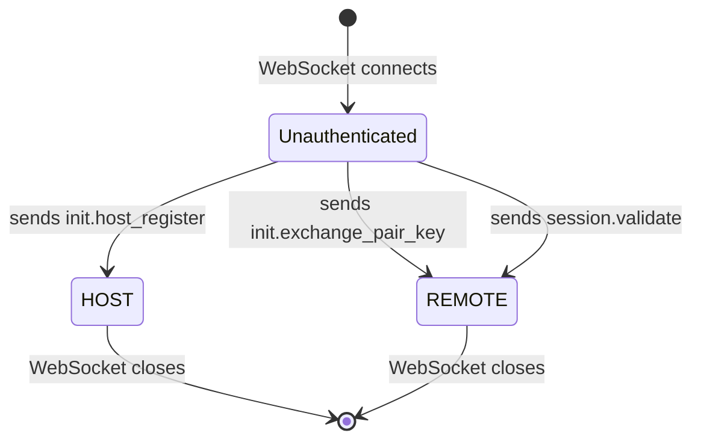
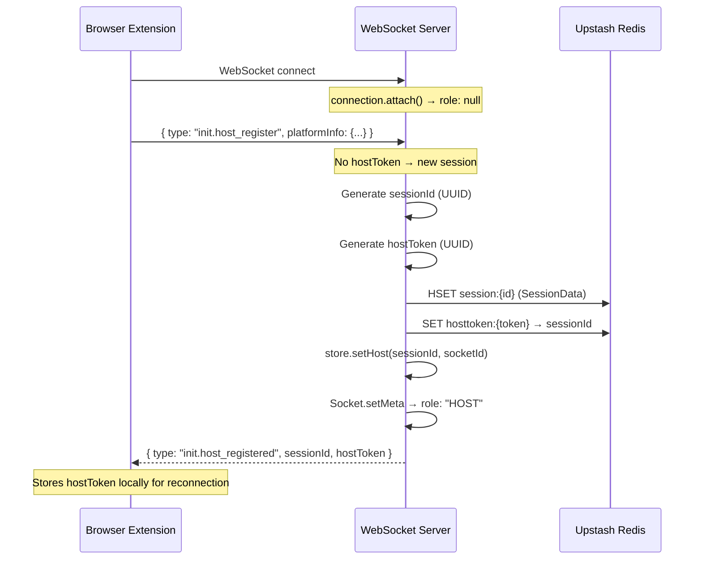
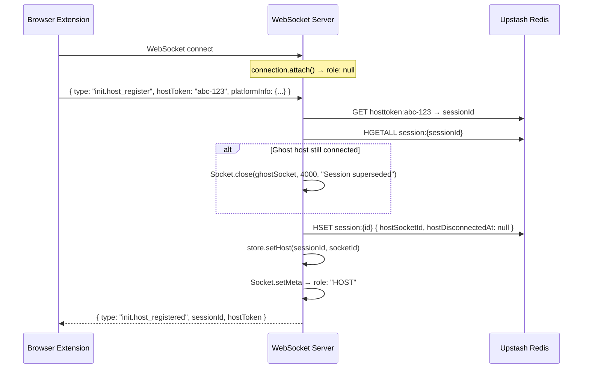
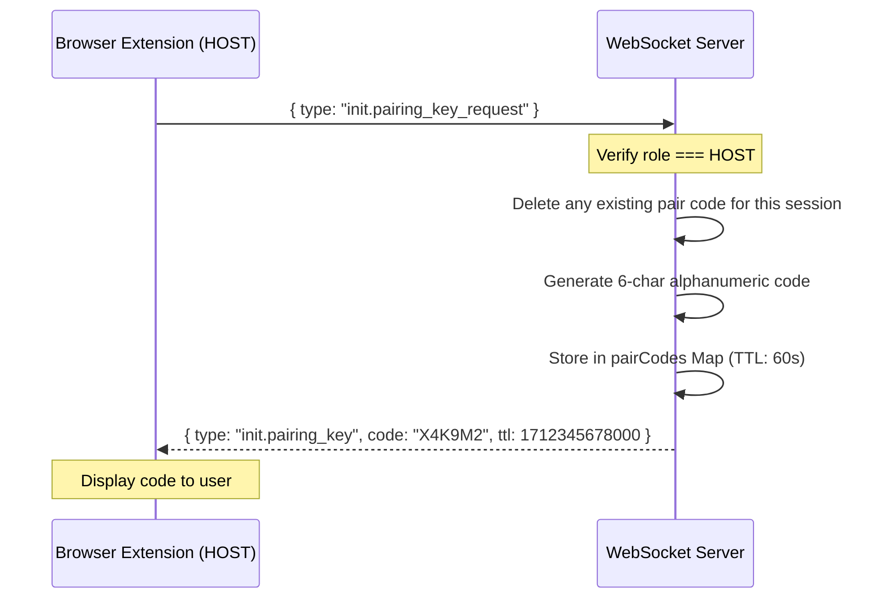
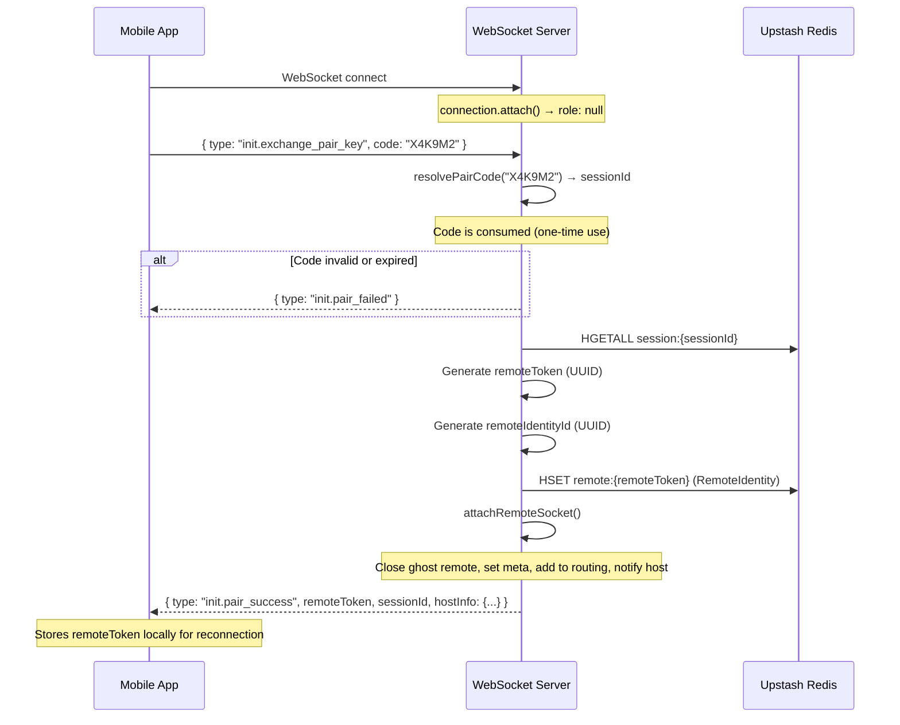
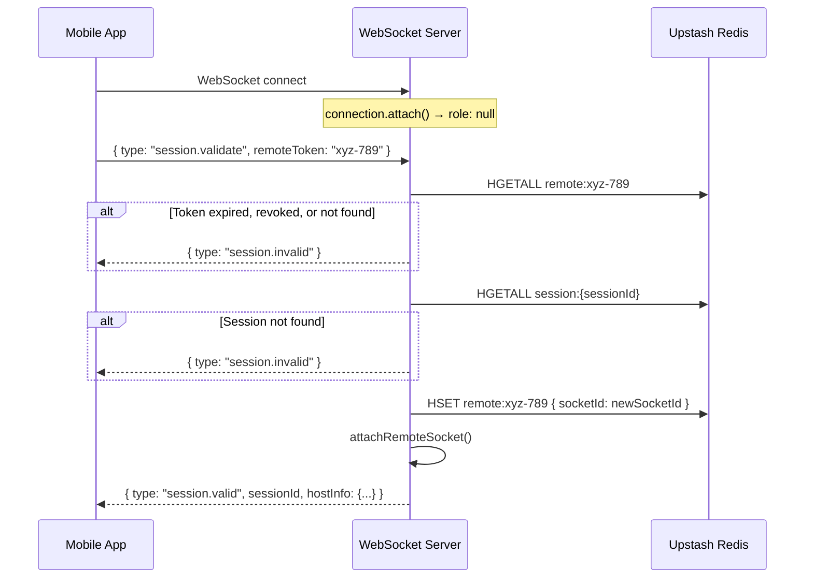

# Authentication System — Media Remote Control v2

## Overview

The authentication system manages the entire lifecycle of how a **Host** (browser extension) and **Remote** (mobile app) establish trust, pair with each other, and maintain persistent sessions across reconnections. All communication happens over a single WebSocket endpoint (`/`).

> [!IMPORTANT]
> Every WebSocket connection starts as **Unauthenticated**. There is no pre-authenticated path. Clients must send auth messages to transition into a role.

---

## Architecture

### Role State Machine

Every socket transitions through a strict state machine enforced by the `SocketMeta` discriminated union:



- **Unauthenticated** → `{ role: null, sessionId: null }` — raw socket, can only send auth messages
- **HOST** → `{ role: "HOST", sessionId, hostToken }` — the browser extension controlling media
- **REMOTE** → `{ role: "REMOTE", sessionId, remoteIdentityId, remoteToken }` — the mobile app sending commands

Once a socket transitions to a role, it **cannot change roles**. A remote trying to register as a host is immediately terminated (hard security boundary).

### Where Auth Lives

| File | Responsibility |
|------|---------------|
| [auth.handler.ts](./auth.handler.ts) | All auth logic — the 5 auth message handlers + `attachRemoteSocket` helper |
| [connection.ts](./connection.ts) | Socket lifecycle — initializes `Unauthenticated` metadata on connect, cleans up on disconnect |
| [socket.ts](./socket.ts) | Socket metadata storage (WeakMap), send/close utilities |
| [store.ts](./store.ts) | Persistence — sessions in Redis, socket/route lookups in-memory |
| [router.ts](./router.ts) | Entry point — parses JSON, validates message type, delegates to `handleAuth()` |
| [constants.ts](./constants.ts) | Message type strings and role constants |
| [config.ts](file:///Users/sharadjadhav/Others/Media-Remote-Control-v2/server/src/config/config.ts) | TTL values for pair codes and tokens |

---

## Complete Auth Flows

### Flow 1: New Host Registration

The browser extension connects for the first time (no existing `hostToken`).



### Flow 2: Host Reconnection

The browser extension reconnects with a previously stored `hostToken`.



### Flow 3: Pairing Code Generation

After the host is registered, it requests a pairing code for the remote to enter.



### Flow 4: Remote Pairing via Code

The mobile app enters the pairing code displayed on the host.



### Flow 5: Remote Reconnection (Session Validation)

The mobile app reconnects with a previously stored `remoteToken`.



---

## Function Reference

### `handleAuth(ws, msg, store) → Promise<boolean>`

**Location:** [auth.handler.ts:8](file:///Users/sharadjadhav/Others/Media-Remote-Control-v2/server/src/auth/auth.handler.ts#L8)

**Purpose:** Central auth dispatcher. Every incoming WebSocket message passes through this function (via `router.handle()`). It pattern-matches on `msg.type` to determine which auth flow to execute.

**Returns:** `true` if the message was an auth message (handled), `false` if not (pass through to other handlers).

**Why it returns boolean:** The router uses this as a short-circuit — if `handleAuth` returns `true`, the message is fully consumed and the router stops. This prevents auth messages from leaking into media/control handlers that don't exist yet.

**Parameters:**
| Param | Type | Description |
|-------|------|-------------|
| `ws` | `WebSocket` | The raw socket connection |
| `msg` | `Record<string, unknown>` | Parsed JSON message (already validated by `validator.isValidMessage`) |
| `store` | `Store` | The unified store providing both in-memory and Redis operations |

**Internal behavior:**
1. Captures current timestamp via `utils.now()` (used for token expiry checks)
2. Reads socket metadata via `Socket.metadata(ws)`
3. Dispatches to one of 5 handlers based on `msg.type`
4. Returns `false` only if no auth message type matched

---

### Handler 1: Host Registration (`init.host_register`)

**Lines:** [auth.handler.ts:12-73](file:///Users/sharadjadhav/Others/Media-Remote-Control-v2/server/src/auth/auth.handler.ts#L12-L73)

**Triggered by message:**
```json
{
  "type": "init.host_register",
  "platformInfo": { "os": "Windows", "browser": "Chrome", "extensionVersion": "1.0.0" },
  "hostToken": "optional-existing-token"
}
```

**What it does:**

1. **Security gate** (L13-17) — If the socket is already a `REMOTE`, terminate immediately. This prevents role escalation. A remote device should never be able to become a host.

2. **Reconnection path** (L25-45) — If `hostToken` is provided:
   - Looks up the session via `store.getSessionByHostToken(token)` (Redis: `GET hosttoken:{token}` → `HGETALL session:{id}`)
   - If a ghost host socket is still connected for this session, closes it with code `4000` ("Session superseded"). This handles the case where the old tab/connection didn't properly disconnect.
   - Updates Redis session data: new `hostSocketId`, clears `hostDisconnectedAt`
   - Updates the in-memory route table via `store.setHost()`

3. **New session path** (L48-54) — If no `hostToken` (first time):
   - Generates fresh `sessionId` and `hostToken` (both UUIDs)
   - Creates `SessionData` with platform info
   - Persists to Redis with TTL (30 days)
   - Registers in-memory route

4. **Socket transition** (L57-63) — Overwrites the socket's metadata from `Unauthenticated` to `Host` via `Socket.setMeta()`. This is the point of no return — the socket is now permanently bound to this session as a host.

5. **Response** (L67-71) — Sends back `sessionId` and `hostToken` for the client to persist locally.

**Why `hostToken` exists:** The extension persists this token in `chrome.storage.local`. On browser restart, the extension reconnects with this token to rejoin its existing session without re-pairing all remotes.

**Why platform info is collected:** Sent to remotes during pairing so the mobile app can display "Connected to Chrome on Windows" for user confidence.

---

### Handler 2: Pairing Code Request (`init.pairing_key_request`)

**Lines:** [auth.handler.ts:75-91](file:///Users/sharadjadhav/Others/Media-Remote-Control-v2/server/src/auth/auth.handler.ts#L75-L91)

**Triggered by message:**
```json
{ "type": "init.pairing_key_request" }
```

**What it does:**

1. **Role guard** (L76) — Only `HOST` sockets can request pairing codes. If any other role sends this, it's silently ignored (returns `true` to consume the message).

2. **Cleanup** (L78) — Deletes any existing pair code for this session. This prevents code accumulation — only one active code per session at a time.

3. **Code generation** (L80) — Calls `utils.generatePairCode()` which produces a 6-character string from `ABCDEFGHJKLMNPQRSTUVWXYZ23456789` (note: no `I`, `O`, `0`, `1` to avoid ambiguity when users read codes aloud or on screen).

4. **Storage** (L81) — Stores the code in an in-memory `Map<string, PairCodeEntry>` with a `setTimeout` for auto-expiry (60 seconds). Returns the absolute expiry timestamp.

5. **Response** (L85-89) — Sends back the code and its TTL so the extension can display a countdown.

**Why in-memory and not Redis:** Pair codes are extremely short-lived (60s) and only need to be resolved on the same server instance that created them. Since both host and remote connect to the same server, in-memory storage avoids unnecessary Redis round-trips.

**Why one code per session:** Prevents confusion. If a user generates multiple codes, old ones should be invalid. The `deletePairCode` → `setPairCode` sequence ensures exactly one active code.

---

### Handler 3: Pairing Exchange (`init.exchange_pair_key`)

**Lines:** [auth.handler.ts:94-136](file:///Users/sharadjadhav/Others/Media-Remote-Control-v2/server/src/auth/auth.handler.ts#L94-L136)

**Triggered by message:**
```json
{ "type": "init.exchange_pair_key", "code": "X4K9M2" }
```

**What it does:**

1. **Code resolution** (L97) — `store.resolvePairCode(code)` looks up the code, returns the associated `sessionId`, and **deletes the code** (one-time use). If the code doesn't exist or expired, returns `null`.

2. **Session verification** (L103-107) — Fetches the full session from Redis to verify it still exists. The session could have been deleted between code generation and code entry.

3. **Identity creation** (L109-119) — Generates two UUIDs:
   - `remoteToken` — the long-lived credential the remote persists for reconnection (like `hostToken` for hosts)
   - `remoteIdentityId` — an opaque ID representing this specific remote device within the session

4. **Remote registration** (L121) — Persists the `RemoteIdentity` to Redis with 30-day TTL. This structure tracks:
   - Which session this remote belongs to
   - Current socket binding
   - Expiry timestamp
   - Revocation flag (for future use — allows host to kick a remote)

5. **Socket attachment** (L122) — Delegates to `attachRemoteSocket()` (see below).

6. **Response** (L124-133) — Sends `remoteToken`, `sessionId`, and host info (OS, browser, extension version) so the app can display connection details.

**Why the code is consumed on resolve:** One-time use prevents replay attacks. If someone shoulder-surfs the code, they have a 60-second window but can only use it once.

**Why `remoteIdentityId` is separate from `remoteToken`:** The `remoteIdentityId` is shared with the host (in `session.remote_joined` messages) and used for message routing. The `remoteToken` is a secret known only to the remote and the server — it's never sent to the host.

---

### Handler 4: Session Validation (`session.validate`)

**Lines:** [auth.handler.ts:139-171](file:///Users/sharadjadhav/Others/Media-Remote-Control-v2/server/src/auth/auth.handler.ts#L139-L171)

**Triggered by message:**
```json
{ "type": "session.validate", "remoteToken": "xyz-789" }
```

**What it does:**

1. **Identity lookup** (L142) — Fetches the `RemoteIdentity` from Redis using the provided `remoteToken`.

2. **Triple validation** (L144-148):
   - `!identity` → Token doesn't exist in Redis (expired past TTL, or never existed)
   - `identity.revoked` → Host explicitly revoked this remote's access
   - `t > identity.expiresAt` → Token expired (checked at application level, independent of Redis TTL)

3. **Session existence check** (L150-155) — Even if the remote identity is valid, the session itself may have expired or been deleted.

4. **Socket rebinding** (L157) — Updates the `RemoteIdentity` in Redis with the new `socketId` (since this is a new WebSocket connection).

5. **Socket attachment** (L158) — Same `attachRemoteSocket()` flow as initial pairing.

6. **Response** (L160-168) — Same structure as pairing success, but with type `session.valid`.

**Why this exists:** The mobile app may close, the phone may sleep, or the network may drop. When the app reopens, it needs to rejoin without re-entering a pairing code. The `remoteToken` (stored in the app's local storage) enables this seamless reconnection.

**Why double expiry (Redis TTL + `expiresAt`):** Defense in depth. Redis TTL ensures cleanup even if the server never checks `expiresAt`. The `expiresAt` check ensures the server rejects tokens that are logically expired even if Redis hasn't evicted them yet (possible with key-level TTL rounding).

---

### `attachRemoteSocket(ws, identity, remoteToken, sessionId, _session, store)`

**Lines:** [auth.handler.ts:176-214](file:///Users/sharadjadhav/Others/Media-Remote-Control-v2/server/src/auth/auth.handler.ts#L176-L214)

**Purpose:** Shared helper used by both pairing exchange (Flow 4) and session validation (Flow 5). Handles the common work of binding a remote socket to a session.

**What it does:**

1. **Ghost cleanup** (L187-191) — Checks if an older socket for this same `remoteIdentityId` is still connected. If so, closes it with code `4000`. This handles:
   - Stale connections that didn't properly close
   - Duplicate connections from the same device
   - Tab duplication or app backgrounding edge cases

2. **Socket transition** (L194-201) — Overwrites metadata from `Unauthenticated` to `Remote`:
   ```typescript
   { role: "REMOTE", sessionId, remoteIdentityId, remoteToken }
   ```

3. **Route registration** (L203) — `store.addRemoteToSession()` does two things:
   - **In-memory:** Adds `remoteId → socketId` to the session's route table (for fast message routing)
   - **Redis:** Adds `remoteId → remoteToken` to `session:{id}:remotes` hash (for persistence)

4. **Host notification** (L206-213) — If the host is currently connected, sends it a `session.remote_joined` message with the `remoteId`. This allows the host extension to update its UI (e.g., show "1 remote connected").

**Why it's a separate function:** Avoids code duplication between initial pairing and reconnection. Both paths need identical ghost cleanup, meta transition, routing, and host notification.

**Why `_session` is unused:** The session parameter is passed through but currently unused (prefixed with `_`). It's kept in the signature for future use — e.g., checking session-level constraints like max remote count.

---

## Data Models

### SocketMeta (In-Memory — WeakMap)

Stored per-socket in a `WeakMap<WebSocket, SocketMeta>`. Automatically garbage-collected when the socket is closed and dereferenced.

```typescript
// Before auth
interface Unauthenticated {
  socketId: string;       // UUID assigned on connect
  role: null;
  lastSeenAt: number;     // For rate limiting
  sessionId: null;
}

// After host registers
interface Host {
  socketId: string;
  role: "HOST";
  lastSeenAt: number;
  sessionId: string;      // The session this host owns
  hostToken: string;      // Secret for reconnection
}

// After remote pairs or validates
interface Remote {
  socketId: string;
  role: "REMOTE";
  lastSeenAt: number;
  sessionId: string;      // The session this remote joined
  remoteIdentityId: string; // Unique ID within the session
  remoteToken: string;    // Secret for reconnection
}
```

### SessionData (Redis — Hash)

Key: `session:{sessionId}` | TTL: 30 days

```typescript
interface SessionData {
  hostOS: string | null;              // e.g., "Windows"
  hostBrowser: string | null;         // e.g., "Chrome"
  hostExtensionVersion: string | null; // e.g., "1.0.0"
  hostToken: string;                   // Secret — maps back to this session
  hostDisconnectedAt: number | null;   // Timestamp when host last disconnected
  hostSocketId: string;                // Current host's socketId (empty string if disconnected)
}
```

**Why `hostDisconnectedAt`:** Enables the remote to know the host is temporarily offline vs. permanently gone. Future use: auto-expire sessions if host hasn't reconnected within X time.

### RemoteIdentity (Redis — Hash)

Key: `remote:{remoteToken}` | TTL: 30 days

```typescript
interface RemoteIdentity {
  id: string;              // remoteIdentityId — shared with the host
  sessionId: string;       // Which session this remote belongs to
  socketId: string | null;  // Current socket binding (null if disconnected)
  expiresAt: number;        // Application-level expiry (millisecond timestamp)
  revoked: boolean;         // Can be set to true to permanently block this remote
  remoteToken: string;      // The token itself (stored for cross-referencing)
}
```

### Route Table (In-Memory — Map)

Key: `sessionId` → `{ hostSocketId, remotes: Map<remoteId, socketId> }`

This is the fast-path lookup for message routing. When a remote sends a media command, the server looks up the host socket via `store.getHostSocket(sessionId)` which hits this in-memory map — no Redis round-trip.

---

## Store Dependencies (Auth-Related)

The auth handler depends on these store functions:

| Store Function | Storage | Used By | Purpose |
|---|---|---|---|
| `registerSocket(id, ws)` | In-memory | `connection.attach()` | Index socket by ID for later lookup |
| `removeSocket(id)` | In-memory | `connection.onClose()` | Remove socket reference |
| `getSocket(id)` | In-memory | — | Lookup socket by ID |
| `setHost(sessionId, socketId)` | In-memory | Host register | Add host to route table |
| `clearHost(sessionId)` | In-memory | Host disconnect | Remove host from route table |
| `getHostSocket(sessionId)` | In-memory | `attachRemoteSocket` | Find host socket to notify |
| `isHostValid(sessionId, socketId)` | In-memory | Host disconnect | Verify the disconnecting socket is the current host |
| `addRemoteToSession(sessionId, remoteId, token, socketId)` | Both | `attachRemoteSocket` | Register remote in route table + Redis |
| `removeRemoteFromSession(sessionId, remoteId)` | Both | Remote disconnect | Unregister remote |
| `getRemoteSocket(sessionId, remoteId)` | In-memory | `attachRemoteSocket` | Find ghost remote to close |
| `setPairCode(code, sessionId)` | In-memory | Pairing request | Store pair code with auto-expiry timer |
| `resolvePairCode(code)` | In-memory | Pairing exchange | One-time lookup + delete |
| `deletePairCode(sessionId)` | In-memory | Pairing request | Clean up old code before generating new one |
| `createSession(id, token, data)` | Redis | New host register | Persist session + host token index |
| `getSession(sessionId)` | Redis | Pairing exchange, session validate | Verify session exists |
| `getSessionByHostToken(token)` | Redis | Host reconnect | Lookup session by host's stored token |
| `updateSession(sessionId, fields)` | Redis | Host reconnect, host disconnect | Partial update of session fields |
| `registerRemote(token, identity)` | Redis | Pairing exchange | Persist remote identity |
| `getRemote(token)` | Redis | Session validate | Lookup remote identity for reconnection |
| `updateRemote(token, fields)` | Redis | Session validate | Update socketId on reconnection |

---

## Configuration Requirements

From [config.ts](file:///Users/sharadjadhav/Others/Media-Remote-Control-v2/server/src/config/config.ts):

| Config | Value | Used For |
|---|---|---|
| `pairCodeTtlMs` | `60,000` (1 minute) | How long a pairing code remains valid |
| `tokenTtlMs` | `2,592,000,000` (30 days) | Redis TTL for sessions, host tokens, and remote identities |
| `rateLimit` | `200` ms | Minimum interval between messages (checked in `validator.isRateLimited`) |
| `upstashRedisRestUrl` | env var | Redis connection URL (required) |
| `upstashRedisRestToken` | env var | Redis auth token (required) |

---

## Security Properties

| Property | How It's Enforced |
|---|---|
| **No role escalation** | Remote sending `host_register` → socket terminated immediately (L13-17) |
| **One-time pairing codes** | `resolvePairCode()` deletes the code atomically on lookup |
| **Short code window** | 60-second TTL with `setTimeout` auto-cleanup |
| **Token secrecy** | `hostToken` only sent to host, `remoteToken` only sent to remote, neither shared cross-role |
| **Ghost socket cleanup** | Both host and remote reconnection paths close stale sockets (code 4000) |
| **Double expiry** | Redis TTL + application-level `expiresAt` check on remote tokens |
| **Token revocation** | `RemoteIdentity.revoked` flag checked on every `session.validate` |
| **Type-level safety** | `SocketMeta` discriminated union prevents accessing role-specific fields on wrong role |

---

## Message Type Reference

| Constant | String | Direction | Purpose |
|---|---|---|---|
| `auth.hostRegister` | `init.host_register` | Client → Server | Host wants to register (new or reconnect) |
| `auth.hostRegistered` | `init.host_registered` | Server → Client | Registration successful |
| `auth.pairingKeyRequest` | `init.pairing_key_request` | Client → Server | Host requests a pairing code |
| `auth.pairingKey` | `init.pairing_key` | Server → Client | Here's your 6-char code + TTL |
| `auth.exchangePairKey` | `init.exchange_pair_key` | Client → Server | Remote submits a pairing code |
| `auth.pairSuccess` | `init.pair_success` | Server → Client | Pairing succeeded, here's your remoteToken |
| `auth.pairFailed` | `init.pair_failed` | Server → Client | Code invalid or expired |
| `auth.validateSession` | `session.validate` | Client → Server | Remote reconnects with stored token |
| `auth.sessionValid` | `session.valid` | Server → Client | Token valid, session restored |
| `auth.sessionInvalid` | `session.invalid` | Server → Client | Token expired/revoked/not found |
| `auth.remoteJoined` | `session.remote_joined` | Server → Host | A remote just connected to your session |

---

## Disconnect Handling

Handled in [connection.ts](file:///Users/sharadjadhav/Others/Media-Remote-Control-v2/server/src/connection/connection.ts) `onClose()`:

**Host disconnects:**
1. Remove socket from in-memory index
2. Verify this socket is still the current host for the session (`isHostValid`) — prevents race conditions where a reconnected host's socket doesn't get cleared
3. Clear host from route table
4. Update Redis: set `hostSocketId` to empty string, record `hostDisconnectedAt` timestamp
5. TODO: Notify connected remotes that host is offline

**Remote disconnects:**
1. Remove socket from in-memory index
2. Remove remote from both in-memory route table and Redis session remotes hash

> [!NOTE]
> Remote disconnection doesn't delete the `RemoteIdentity` from Redis. The identity persists for 30 days so the remote can reconnect via `session.validate` without re-pairing.
